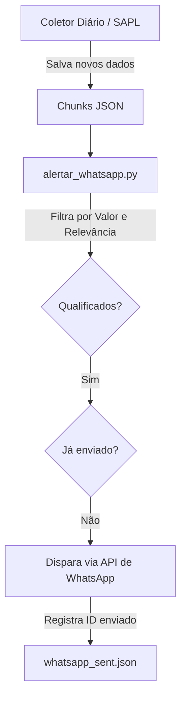

# 📲 Como Enviar os Alertas Diários para o WhatsApp

Criamos o script `alertar_whatsapp.py` na pasta `painel-cidadao` para fazer a postagem automática de novos contratos, compras públicas relevantes e projetos de leis diretamente em uma comunidade ou grupo do WhatsApp.

---

## 🛠️ Como Funciona o Fluxo



1. **Evita Duplicados**: O bot armazena os IDs dos atos já transmitidos em `private/state/whatsapp_sent.json`. Nunca uma mensagem será enviada duas vezes.
2. **Filtro de Relevância**: Para evitar spammer no grupo, você pode definir regras de valor mínimo (ex: contratos acima de R$ 10.000,00) ou enviar apenas matérias qualificadas como relevante/interesse público pela inteligência artificial.

---

## ⚙️ Configuração dos Tokens (`private/whatsapp_config.json`)

Você encontrará o modelo configurável em `private/whatsapp_config.json`. Configure os seguintes campos:

```json
{
  "api_type": "evolution",              // Opções: "evolution", "z-api", "callmebot"
  "api_url": "https://sua-api.com",     // Endereço do servidor da API (não necessário para CallMeBot)
  "instance_id": "fiscaliza",           // Nome da instância do WhatsApp Web pareada
  "token": "SEU_TOKEN_API_AQUI",        // Token ou chave de API de autenticação
  "group_id": "120363000000000000@g.us", // ID do grupo (JID) ou telefone destino
  "filtrar_relevantes_apenas": true,    // Envia apenas o que a IA marcar como interesse público alto/médio
  "valor_minimo_alerta_compras": 10000.0, // Alerta compras do diário oficial acima desse valor (R$)
  "enviar_legislativo": true,
  "enviar_diario_oficial": true
}
```

### Provedores de API Suportados:
* **Evolution API (Recomendado/Open-Source)**: Instância própria rodando em Docker. Suporta envio em massa nativo para grupos.
* **Z-API (Serviço Pago)**: Serviço SaaS de API brasileira de WhatsApp muito estável.
* **CallMeBot (Gratuito/Testes)**: Envio simples. Para grupos de teste e notificações pessoais rápidas.

---

## 🏃 Como Executar

Após rodar o coletor diário normal do projeto, execute o script de alertas:

```powershell
python painel-cidadao/alertar_whatsapp.py
```

### Automação (Execução Diária)
Você pode adicionar a execução do script de alertas no arquivo `.bat` que roda o coletor principal (ex: `atualizar.bat` ou `atualizar-agendado.bat`) para que, logo após a coleta, as mensagens sejam disparadas para o WhatsApp.
