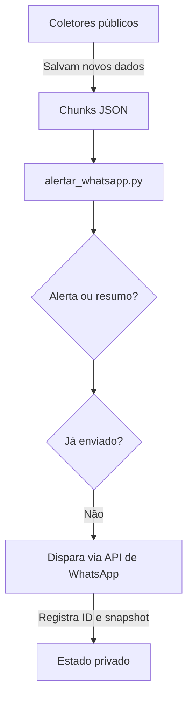

# Como funcionam os alertas do WhatsApp

O script `painel-cidadao/alertar_whatsapp.py` publica conteúdos da Prefeitura e da Câmara no grupo configurado. Ele mantém os boletins detalhados e também monitora compras de qualquer valor, obras, diárias, atividade legislativa e pendências de transparência.

---

## 🛠️ Como Funciona o Fluxo



1. **Data mínima:** itens anteriores a `2026-07-01` não são enviados.
2. **Relevância:** matérias de interesse alto ou médio recebem boletim individual.
3. **Qualquer valor:** o corte financeiro é zero; compras pequenas também entram no monitoramento.
4. **Conteúdo rotineiro:** entra no resumo semanal para não poluir o grupo.
5. **Obras e transparência:** a primeira execução cria uma linha de base. Somente mudanças futuras geram alertas, evitando uma avalanche retroativa.
6. **Duplicidade:** IDs enviados ficam em `private/state/whatsapp_sent.json`; snapshots ficam em `private/state/whatsapp_monitor_state.json`.

---

## ⚙️ Configuração dos Tokens (`private/whatsapp_config.json`)

Você encontrará o modelo configurável em `private/whatsapp_config.json`. Configure os seguintes campos:

```json
{
  "api_type": "evolution",              // Opções: "evolution", "z-api", "callmebot"
  "api_url": "https://sua-api.com",     // Endereço do servidor da API (não necessário para CallMeBot)
  "instance_id": "fiscaliza",           // Nome da instância do WhatsApp Web pareada
  "token": "SEU_TOKEN_API_AQUI",        // Token ou chave de API de autenticação
  "group_id": "120363000000000000@g.us", // ID do grupo (JID) ou telefone destino
  "filtrar_relevantes_apenas": true,
  "valor_minimo_alerta_compras": 0.0,
  "data_minima_envio": "2026-07-01",
  "enviar_legislativo": true,
  "enviar_diario_oficial": true,
  "enviar_obras": true,
  "enviar_diarias": true,
  "enviar_alertas_transparencia": true,
  "enviar_resumo_semanal": true,
  "dia_resumo_semanal": 5
}
```

`dia_resumo_semanal` usa o padrão do Python: segunda-feira é `0` e sábado é `5`.

### Provedores de API Suportados:
* **Evolution API (Recomendado/Open-Source)**: Instância própria rodando em Docker. Suporta envio em massa nativo para grupos.
* **Z-API (Serviço Pago)**: Serviço SaaS de API brasileira de WhatsApp muito estável.
* **CallMeBot (Gratuito/Testes)**: Envio simples. Para grupos de teste e notificações pessoais rápidas.

---

## 🎯 Como Descobrir o ID do Grupo (JID) usando o seu Link de Convite

Você nos forneceu o link de convite do seu grupo:
`https://chat.whatsapp.com/ImAaUvQaHgM4WUsHf0SNJc`

O código de convite único do seu grupo é **`ImAaUvQaHgM4WUsHf0SNJc`**. Você pode usar esse código nas APIs de WhatsApp integradas para obter o ID de grupo real (JID) que termina com `@g.us`:

* **Pela Evolution API**:
  Faça uma requisição `GET` no endpoint da sua instância do Evolution:
  `GET /group/inviteInfo?inviteCode=ImAaUvQaHgM4WUsHf0SNJc`
  Ela retornará os metadados do grupo contendo o campo `"id"` (ex: `120363XXXXXXXXXXXX@g.us`). Copie esse ID e cole no campo `"group_id"` do seu `private/whatsapp_config.json`.

* **Pela Z-API**:
  Faça uma requisição `GET` usando a sua URL da Z-API:
  `GET /instances/SUA_INSTANCIA/token/SEU_TOKEN/find-group-by-invite-code/ImAaUvQaHgM4WUsHf0SNJc`
  A resposta retornará o JSON completo com o JID correto do grupo no campo `"id"`.

---

## 🏃 Como Executar

Após rodar o coletor diário normal do projeto, execute o script de alertas:

```powershell
python painel-cidadao/alertar_whatsapp.py
```

Antes de qualquer disparo, gere uma prévia completa:

```powershell
python painel-cidadao/alertar_whatsapp.py --preview
```

Esse comando força a exibição do resumo da semana, imprime todas as mensagens no terminal e não altera nenhum arquivo de estado.

Para gerar o resumo fora do dia programado:

```powershell
python painel-cidadao/alertar_whatsapp.py --resumo-semanal
```

### Automação (Execução Diária)
Você pode adicionar a execução do script de alertas no arquivo `.bat` que roda o coletor principal (ex: `atualizar.bat` ou `atualizar-agendado.bat`) para que, logo após a coleta, as mensagens sejam disparadas para o WhatsApp.
